# Readbrick

A local, self-hosted read-along ebook reader: natural English text-to-speech,
word-by-word highlighting synced to the audio, adjustable playback speed, and a
per-user library.

No login. No cloud. All data lives in `~/.reader/`.

<p align="center">
  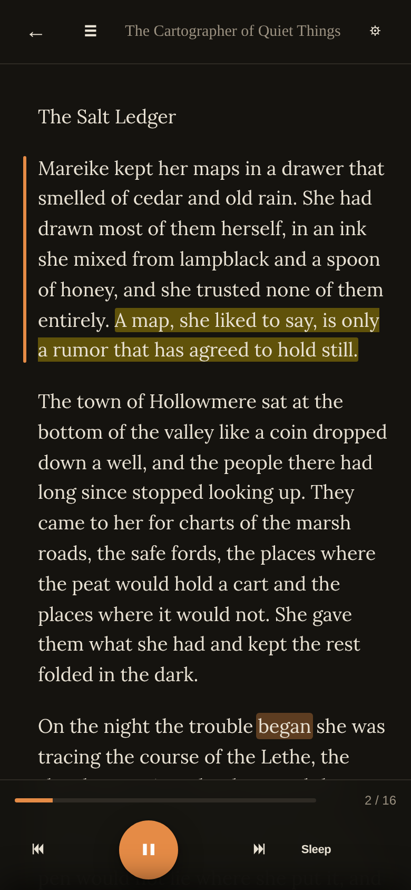
</p>
<p align="center"><em>Read-along TTS with word-by-word highlighting</em></p>

## Quick start

**Docker (recommended)** — runs the reader + the Kokoro TTS sidecar together:

```bash
docker compose up -d --build
```

Open <http://127.0.0.1:8000/>, pick a user, upload an EPUB, hit play. TTS is
[Kokoro-82M](#text-to-speech-kokoro) running on the CPU — the first time you hit a
given paragraph at a given speed it synthesizes in ~5s, then it's instant.

**Run the server on the host instead** (with TTS still in a container):

```bash
python -m venv .venv && source .venv/bin/activate
pip install -e .
docker compose up -d kokoro-tts   # just the TTS sidecar
python -m server.app
```

---

## Features

### Library with continue-reading hero, search, and status chips

<p align="center">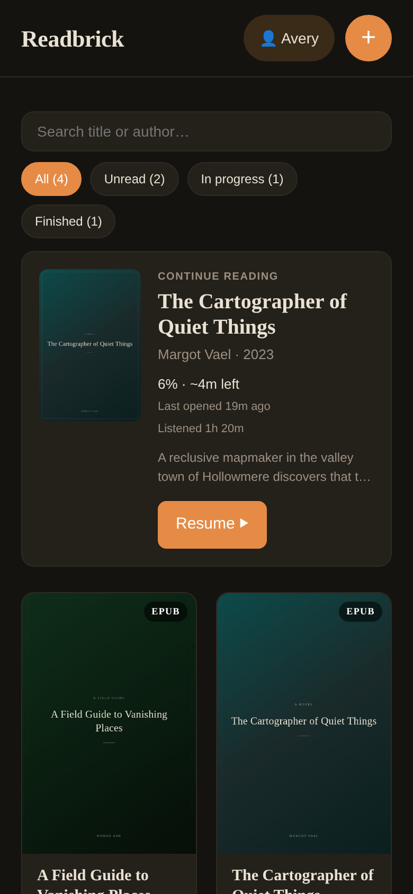</p>

The most-recently-read book lifts to the top in a hero band: cover, current chapter, percentage, time-remaining, and cumulative listening time. A sticky search box filters by title or author; status chips slice the grid into `All / Unread / In progress / Finished` with live counts. Search and chip state persists in `sessionStorage`.

### Reader: TTS, word highlighting, and audiobook-style seek

<p align="center">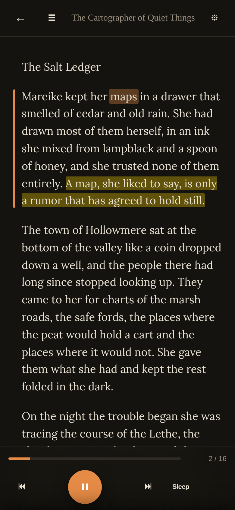</p>

Word-level highlighting follows the audio with a soft pill driven by `requestAnimationFrame` (~60 Hz) — each individual word lights up as it's spoken, not the whole sentence. As audio crosses through a long paragraph, the page autoscrolls to keep the active word inside the middle 60% of the viewport. Voice selection (28 English voices) lives in the settings sheet — see [Text-to-speech (Kokoro)](#text-to-speech-kokoro) below. Footer controls: ⏮ / ⏭ for paragraph nav, ⏯ for play/pause, a tap-cycle speed pill (0.5× – 2.0×), and Sleep. Tap a word while paused to seek there; tap the progress bar to jump.

### Immersive playback — chrome auto-hides, double-tap edges to ±15s

<p align="center">
  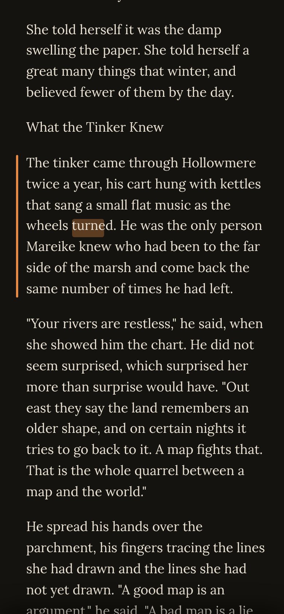
  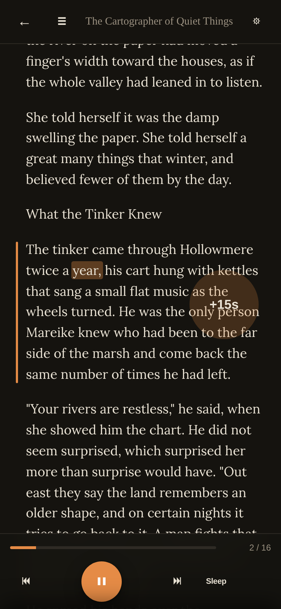
  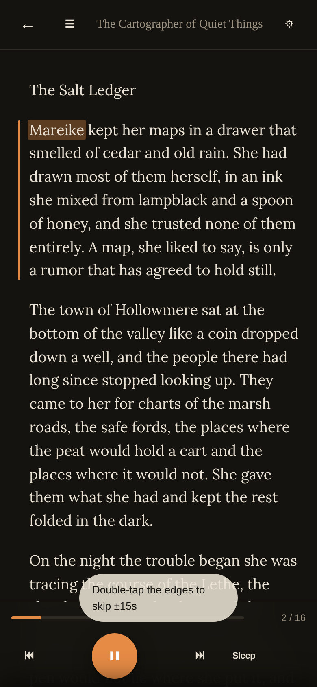
</p>

After 3 seconds of playback without interaction the header and footer fade away — just the words and the orange pill. Tap anywhere to bring the controls back; pause forces them visible immediately. Open a settings sheet, chapters drawer, sleep timer, or quote toolbar and the chrome stays put for as long as that surface is open.

For ±15 second seeks, double-tap the side gutters (outside the text column) — left for back, right for forward. A circular `−15s` / `+15s` flashes on the tapped side. The first time you press play, a one-time toast teaches the gesture. Tap-on-a-word-to-seek (while paused) still works exactly like before — gutter taps and word taps don't conflict. Honors `prefers-reduced-motion`.

### Inline images — figures kept, with a show/hide toggle and tap-to-zoom

<p align="center">
  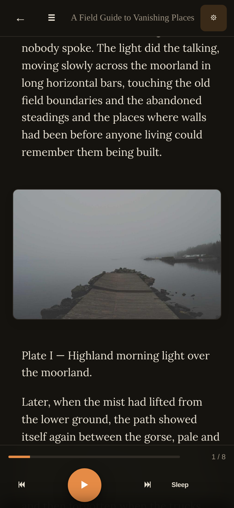
  
  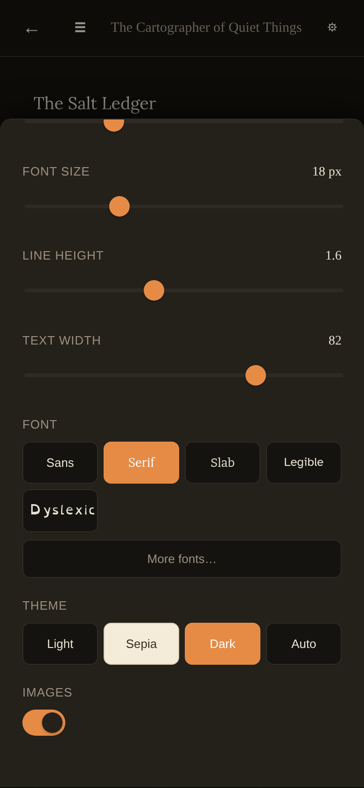
</p>

Uploads keep their pictures. EPUB (and MOBI/AZW3) figures and embedded PDF images are extracted on ingest and rendered **inline at their place in the reading flow** — the picture sits with its caption instead of leaving a captionless gap. An **Images** toggle in the settings sheet hides or shows every figure instantly (default on, remembered per user); tap any figure to open it fullscreen, then tap anywhere or press **Esc** to close.

Images live in a sidecar alongside the text, anchored to the paragraph they follow, so they never disturb the read-along: the word-highlight pill, saved progress, and quotes stay aligned, and playback simply flows past each picture. Applies to **new uploads** — books already in your library were ingested before this and stay text-only unless you re-upload them.

### Quotes — drag-select, save, export to Obsidian

<p align="center">
  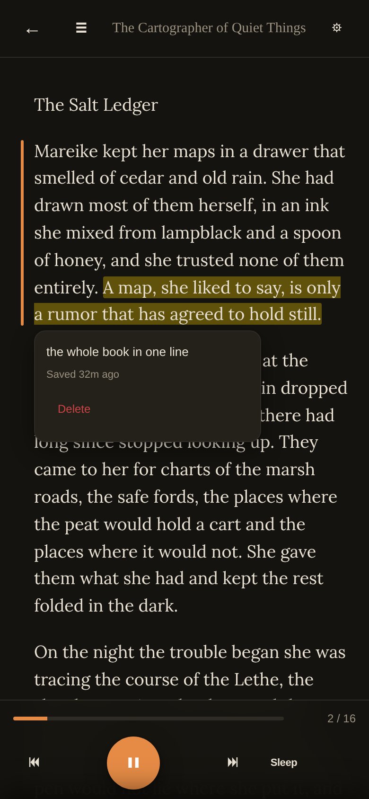
</p>

Drag-select any text in the reader → a floating toolbar appears with an optional note input + Save. The highlight stays visible across re-visits as a soft yellow `<mark>`. Tap it to see the note, when it was saved, and a Delete button. Per-book Markdown export from the book detail page — drop the file into your Obsidian vault (or any vault tool). Single-paragraph quotes only; cross-paragraph selections clip to the start paragraph.

### Book detail page — view, edit, refresh, cover gallery, delete

<p align="center">
  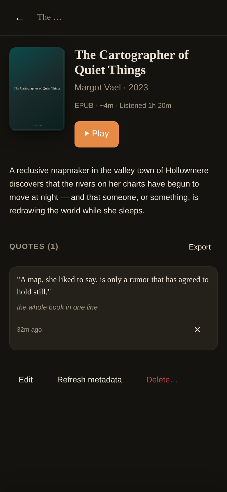
  
  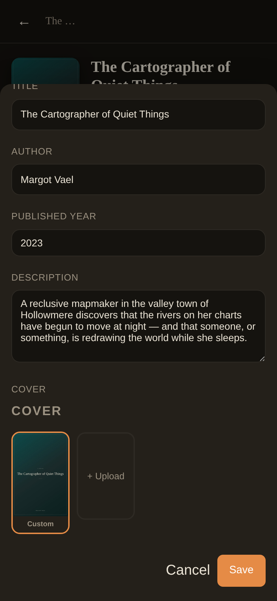
</p>

Tap any book in the library to open `/book/:id`. Title, author/year, format, est-reading-time, cumulative listening time, description. Edit any field via a bottom-sheet. Refresh metadata re-runs the OpenLibrary → Google Books cascade — fills only NULL fields, never clobbers your edits. Up to 5 cover candidates (EPUB-extracted, PDF page-1 via pymupdf, OpenLibrary, Google Books, custom JPG/PNG upload) — tap to switch. Typed-title-confirm delete.

### Auto metadata enrichment on upload

When you upload a book, the server queries [OpenLibrary](https://openlibrary.org) by ISBN (if the EPUB carries one) or title+author, falling back to [Google Books](https://books.google.com). Pulls description, year, genre/subjects, and a better cover. If both miss or you're offline, the book ingests with whatever the file itself contained — no errors, no blocking.

**Google Books needs an API key.** As of 2026 Google removed anonymous quota for the Books API; every request without a key returns 429. To enable the Google Books fallback:

1. Go to <https://console.cloud.google.com/> → create a project (or pick existing).
2. <https://console.cloud.google.com/apis/library/books.googleapis.com> → click **Enable**.
3. <https://console.cloud.google.com/apis/credentials> → **Create Credentials → API key**. Copy the key.
4. Export it before starting the server: `export GOOGLE_BOOKS_API_KEY=AIzaSy…` (or add to a `.env` / your shell profile).

Without the key, the Google Books fallback is silently skipped — OpenLibrary + manual edit still works. Free tier quota is 1000 requests/day; this app makes at most ~2 per book upload, so you'll never hit the limit.

### Sleep timer

<p align="center">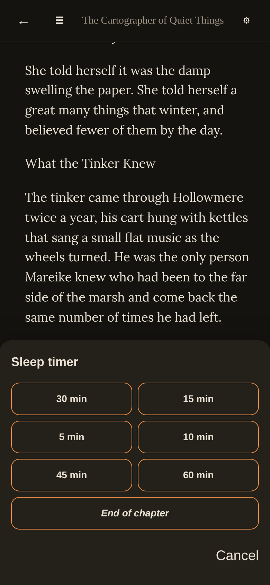</p>

Tap **Sleep** in the reader footer → pick 5/10/15/30/45/60 minutes or **End of chapter**. The button shows a `mm:ss` countdown while active; audio pauses cleanly when the timer fires. Tap the active button to cancel. In-memory only — reload clears.

### Chapter sidebar

<p align="center">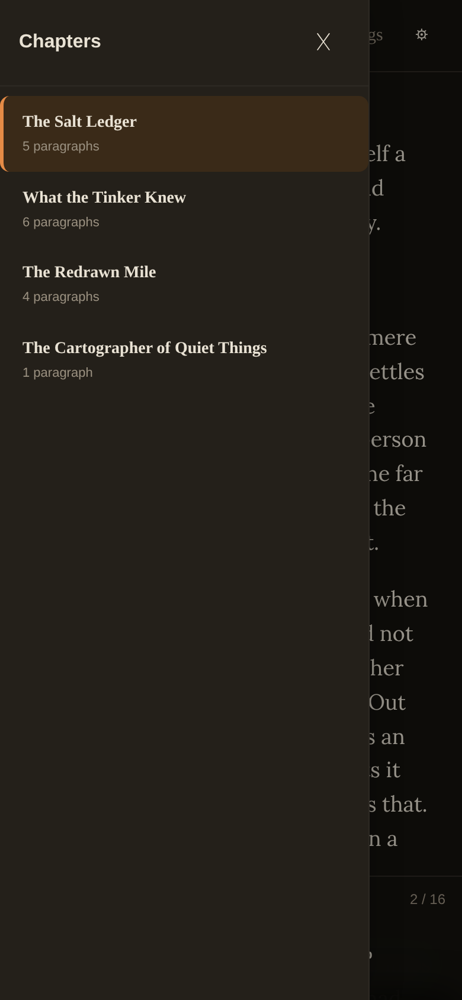</p>

Tap **☰** in the reader header → slide-out left panel listing chapters with paragraph counts. The active chapter is highlighted with a left-border accent. Tap any chapter to jump (preserves play state — auto-resumes if you were playing). Backdrop / Escape closes.

### Per-book listening time

<p align="center"></p>

Cumulative seconds spent actively listening, tracked while audio plays and flushed every 30s (and on pause / unload). Surfaced as `Xh Ym listened` on the library card, the hero band, and the book detail page header.

### Delete book with typed-title confirm

<p align="center">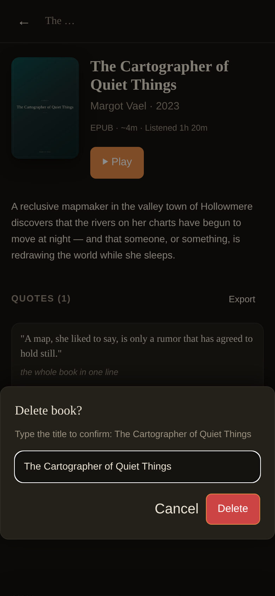</p>

Permanent action, so the Delete button stays disabled until you type the book's exact title into the input. Cancel any time. Removes the row + the `library/<book_id>/` directory + all per-user progress + all quotes (via `ON DELETE CASCADE`).

### Fonts & text width — bundled faces plus the full Google catalog, on demand

<p align="center">
  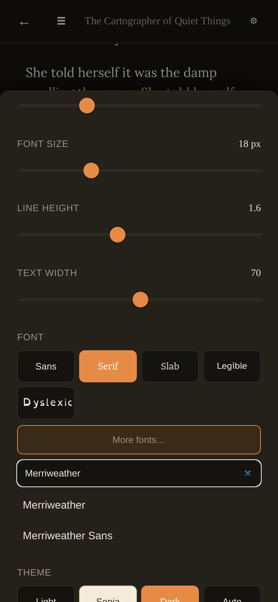
  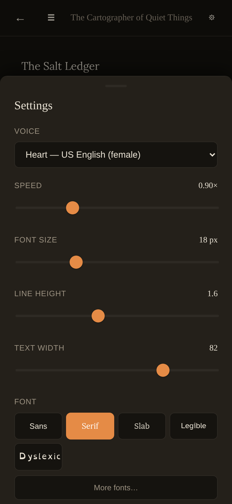
</p>

Five bundled reading faces ship with the app and render identically on every platform — **Sans** (system), **Serif** ([Lora](https://fonts.google.com/specimen/Lora)), **Slab** ([Bitter](https://fonts.google.com/specimen/Bitter)), **Legible** ([Atkinson Hyperlegible](https://fonts.google.com/specimen/Atkinson+Hyperlegible)), and **Dyslexic** ([OpenDyslexic](https://opendyslexic.org/)) — all self-hosted (SIL OFL; see [`NOTICE`](NOTICE)). Need something else? **"More fonts…"** searches the entire [Google Fonts](https://fonts.google.com/) catalog (~1,900 families). Pick one and the **server** downloads its woff2 once, caches it to disk, and serves it from Readbrick thereafter — so your browser never contacts Google, it works offline after the first fetch, and recently-picked fonts stay one tap away. **Text width** is an adjustable slider (45–95 characters) that sets the reading measure in `ch`, so the column scales with your font size.

### Reading prefs per user

Each user remembers their own playback speed, voice, font (family, size, line height), text width, theme, whether inline images are shown, and current position. Tap the gear ⚙ to open settings. Switch users via the pill in the header — instant, no login.

---

## Text-to-speech (Kokoro)

TTS is handled by **[Kokoro-82M](https://huggingface.co/hexgrad/Kokoro-82M)**, running **on the CPU** inside a small Docker container (`kokoro_service/`, the `kokoro-tts` service). No GPU is required — on CPU it runs ~4.4× realtime, fast enough for gapless read-along. The model + all 28 English voices are baked into the image (no download at runtime, no volume).

Audio is synthesized **on demand and streamed inline** — nothing is written to disk. A small bounded in-memory LRU (the most recent ~32 paragraph synths, keyed by text + voice + speed) makes toggling speed, re-reading, and seeking back **instant**; only genuinely-new audio pays the one-time ~5s CPU synth. Continuous playback stays gapless via a small prefetch ring.

### Voices

The picker in the settings sheet groups the **28 English voices** by accent/region. Voice IDs use the `kokoro:` prefix, e.g.:

| Voice ID            | Description                  |
|---------------------|------------------------------|
| `kokoro:af_heart`   | US English, female (default) |
| `kokoro:am_michael` | US English, male             |
| `kokoro:bf_emma`    | UK English, female           |
| `kokoro:bm_george`  | UK English, male             |

…plus `af_/am_` (US) and `bf_/bm_` (UK) variants — `alloy, aoede, bella, jessica, kore, nicole, nova, river, sarah, sky` (af), `adam, echo, eric, fenrir, liam, onyx, puck, santa` (am), `alice, isabella, lily` (bf), `daniel, fable, lewis` (bm).

### Speed

The tap-cycle speed pill (0.5×–2.0×) uses **Kokoro's native `speed` parameter**: the model paces the speech itself — natural prosody, pitch preserved, not time-stretch — and emits per-word timestamps that match, so the read-along pill stays synced at every speed. Each distinct speed is a separate synth (and a separate LRU entry).

### Setup

The Docker quick-start above brings the TTS up with the reader. To (re)build/start just the sidecar:

```bash
docker compose up -d --build kokoro-tts   # ~2.4 GB image; bakes the model + voices
```

When the reader runs on the host, it starts the `kokoro-tts` container on demand and polls `/health` until ready. When the reader runs in Docker (`READER_KOKORO_MANAGED=1`), Compose owns the sidecar (`depends_on: service_healthy`) and the reader just waits for it.

### Configuration

**Reader-side env vars** (how the reader reaches the TTS):

| Env var                   | Default                    | Purpose                                                       |
|---------------------------|----------------------------|---------------------------------------------------------------|
| `READER_KOKORO_URL`       | `http://127.0.0.1:8005`    | TTS base URL (set to `http://kokoro-tts:8005` inside Compose) |
| `READER_KOKORO_MANAGED`   | _(unset)_                  | `1` = Compose owns the sidecar; don't shell out to docker     |
| `READER_KOKORO_COMPOSE`   | `docker-compose.yml`       | Compose file used to start the sidecar (host mode)            |
| `READER_KOKORO_SERVICE`   | `kokoro-tts`               | Compose service name                                          |

**Container env vars** (set in `docker-compose.yml`):

| Env var                | Default      | Purpose                                       |
|------------------------|--------------|-----------------------------------------------|
| `KOKORO_WARMUP_VOICE`  | `af_heart`   | Voice used for the one warmup synth at startup |

### Word timing

Word timings are **Kokoro's own per-word timestamps**, emitted by its duration predictor during synthesis, so they match the (possibly sped/slowed) audio exactly — no separate forced aligner or transcription pass. The reader's source tokenization is anchored to those timestamps; if anchoring is ever too weak it falls back to proportional spacing.

## Optional MOBI/AZW3 support

```bash
sudo pacman -S calibre   # Arch
# or your distro's equivalent
```

## Usage

1. Click **Pick a user** in the top right → add yourself.
2. Click **+** in the top right and drop an EPUB, PDF, TXT, MOBI, or AZW3.
3. Click a book card → detail page → ▶ Play.
4. In the reader: **Space** plays/pauses, **←/→** jumps paragraphs, **+/-** changes font size. Double-tap the left/right side gutters to skip ±15 seconds. Drag-select text → save a quote. Tap **Sleep** to set a timer. Tap **☰** for the chapter list.

Switch users any time by clicking your name pill in the header.

## How it works

```
Browser (vanilla JS) ─ HTTP ─→ FastAPI server ─→ SQLite + filesystem
                                      │
                                      ├─ ebooklib / pymupdf          (ingest)
                                      ├─ Kokoro TTS container :8005   (realtime synth, CPU)
                                      └─ OpenLibrary / Google Books   (metadata)
```

**Storage layout** (under `~/.reader/`, configurable via `READER_DATA_DIR`):

```
data.db                       SQLite: users, books, progress, prefs, quotes
library/<book_id>/            original.<ext>, book.json, cover.jpg, covers/<source>.jpg, images/<NNNN>.<ext>
cache/fonts/<slug>/<n>.woff2  downloaded Google fonts, cached server-side (0 = regular, 1 = italic)
```

Bundled reading fonts ship in the repo at `web/fonts/` (with their OFL licenses under `web/fonts/licenses/`); the searchable Google Fonts catalog is a committed `data/google-fonts-list.json`, regenerable via `scripts/build-font-list.py`.

TTS is **realtime**: `/api/tts` synthesizes on demand and returns the audio inline (base64 → blob URL in the browser); nothing is persisted to disk. A bounded in-memory LRU (32 entries, keyed `text + voice_id + language + speed`) memoizes recent synths so repeats/toggles/seeks are instant. Speed is baked into the audio by Kokoro's native rate, and the per-word timestamps come with it — so the highlight pill stays synced at every speed.

## Configuration

| Env var            | Default              | Purpose                  |
|--------------------|----------------------|--------------------------|
| `READER_DATA_DIR`  | `~/.reader`          | Where everything lives   |
| `READER_HOST`      | `127.0.0.1`          | Listen address           |
| `READER_PORT`      | `8000`               | Listen port              |

## Development

```bash
# python tests
pip install -e .[dev]
pytest tests/ -q

# js unit tests
cd tests/ui && npm install && npm run test:unit

# start just the TTS sidecar (when running the reader on the host)
docker compose up -d kokoro-tts
```

## Known limitations

- **English only.** The TTS model (Kokoro) is English.
- **~5s first synth.** Realtime CPU synthesis means the first time you hit a given paragraph at a given speed costs ~5s; after that the in-memory LRU serves it instantly, and continuous playback is gapless via prefetch. Audio is never written to disk, so it doesn't survive a server restart.
- **PDF is reflowed-text** (embedded images extracted and placed inline) — original page layout is not preserved. Multi-column or footnote-heavy PDFs will look ugly, and a PDF with no extractable text (a pure scan) is rejected on upload.
- **Inline images apply to new uploads only.** Books already in your library were ingested before image extraction existed — re-upload one to pull its pictures in.
- **Single-paragraph quotes only.** Cross-paragraph selections clip to the start paragraph at save time.
- **Downloaded fonts are Latin-subset.** A picked Google font ships its Latin glyphs only; non-Latin runs fall back to the bundled serif. Bundled faces always work offline — downloading a *new* Google font needs internet the first time. Recently-picked fonts are remembered per device (`localStorage`), not per account.

## Credits

Text-to-speech is powered by **[Kokoro-82M](https://huggingface.co/hexgrad/Kokoro-82M)**
by hexgrad — architecture based on [StyleTTS 2](https://github.com/yl4579/StyleTTS2)
(Li et al), licensed under the **Apache License 2.0**. The model weights are baked
into the `kokoro-tts` image; see [`NOTICE`](NOTICE) for the full attribution
(including [misaki](https://github.com/hexgrad/misaki) and espeak-ng).

## License

MIT (see [LICENSE](LICENSE) if present, otherwise public-domain-equivalent for personal use).
